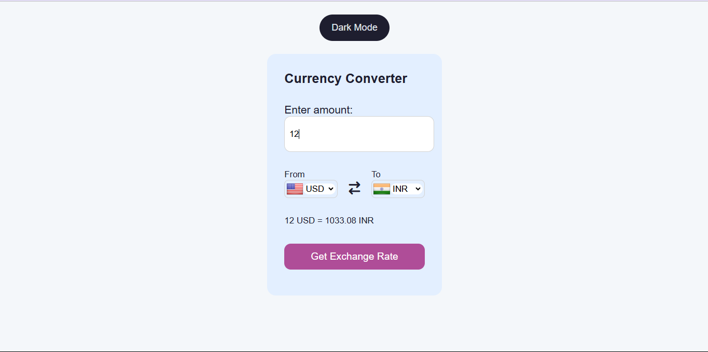

# 💱 Currency Converter

A simple currency converter web app built using **HTML**, **CSS**, and **JavaScript**.  
It uses the **Frankfurter API** to fetch real-time exchange rates.  
Includes Dark Mode and automatic country flag updates.

---

## 🚀 Features

- Live exchange rates  
- Clean, responsive UI  
- Country flag support  
- Dark Mode toggle  

---

## 📸 Preview

---

## 🛠️ Built With

- HTML  
- CSS  
- JavaScript  
- [Frankfurter API](https://www.frankfurter.app)  
- FlagsAPI  
- Font Awesome  

---

## 📂 Project Structure

currency-converter/
├── index.html
├── style.css
├── app.js
├── codes.js
└── currencycalculator.png

---

## 🔍 How It Works

1. Enter an amount.  
2. Select “From” and “To” currencies.  
3. Click **Get Exchange Rate**.  
4. View converted amount; flags update automatically.  
5. Toggle Dark Mode anytime.

---

## 📡 API Used

**Frankfurter API** — provides live exchange rate data.

---

## 🙏 Credits

Created as a learning project during my BCA 1st year.  
Thanks to my teachers.

---

## 👤 About Me

**Name:** Vikash Kherwa  
**Goal:** Learning front-end web development through real projects.
